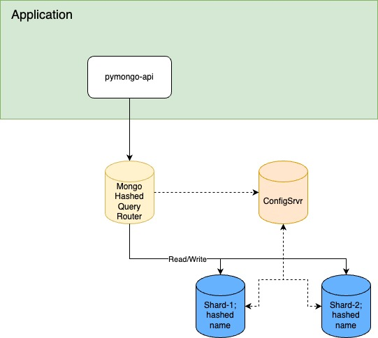
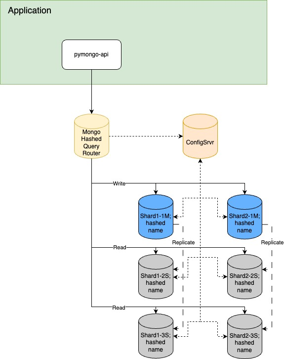
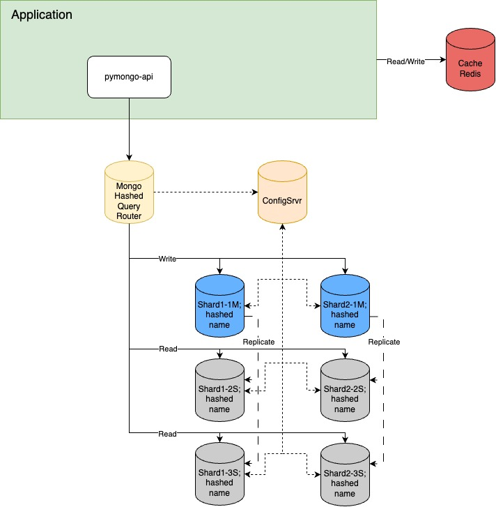
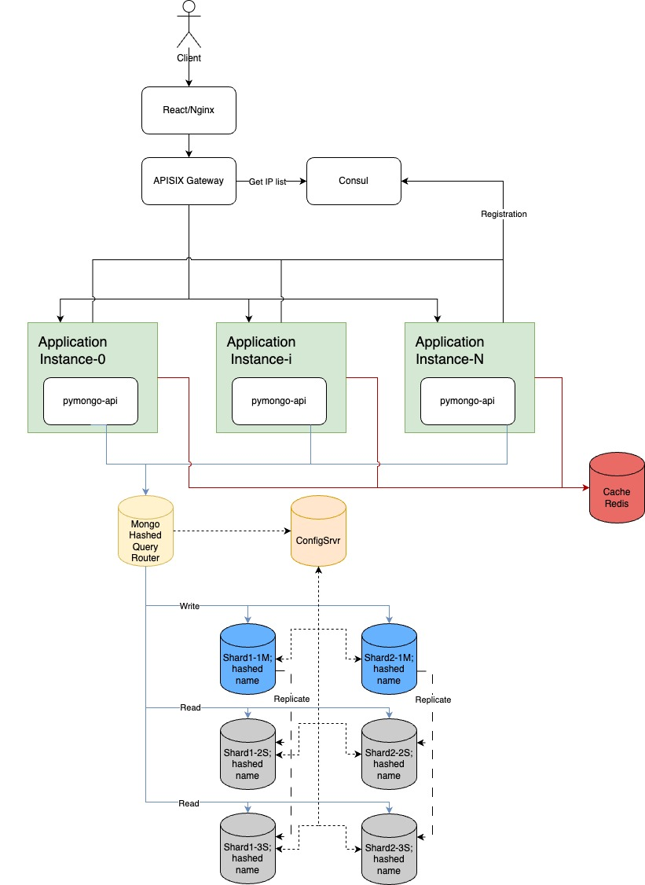
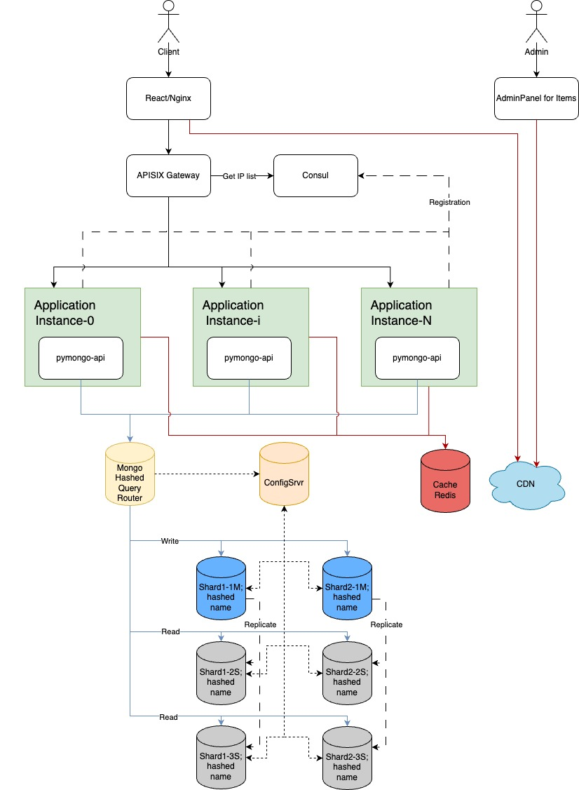

# Sprint2 - Sharding and replication

## How to run and test

### Task 1 - Configure and test sharding (2 shards)



1. Go to folder `./mongo_sharding`
2. Build and start docker compose - execute command ```docker compose up -d```
3. Configure and init sharding, insert some data to DB - execute command ```../scripts/mongo-sharding.sh```
4. Check sharding  - execute command ```../scripts/mongo-sharding-check.sh```

### Task 2 - Configure and test replication for each shard (3 replics for each shard)



1. Go to folder `./mongo_sharding_repl`
2. Build and start docker compose - execute command ```docker compose up -d```
3. Configure and init replics, insert some data to DB - execute command ```../scripts/mongo-sharding-repl.sh```
4. Check replications  - execute command ```../scripts/mongo-sharding-repl-check.sh```

### Task 3 - Configure and test cache (redis)



1. Go to folder `./sharding_repl_cache`
2. Build and start docker compose - execute command ```docker compose up -d```
3. Configure and init sharding with replication, insert some data to DB - execute command ```../scripts/mongo-sharding-repl.sh```
4. Open `http://localhost:8080/users` in browser at developer mode (F12 for Chrome) and choose `Network`. Look at the first loading time. Refresh the page and look at the second and the following reloading time - it should decrease.

### Task4 - Add to design diagramm load balancer based on APISIX Gateway and Consul as Service Discovery



### Task5 - Add Content Delivery Network


